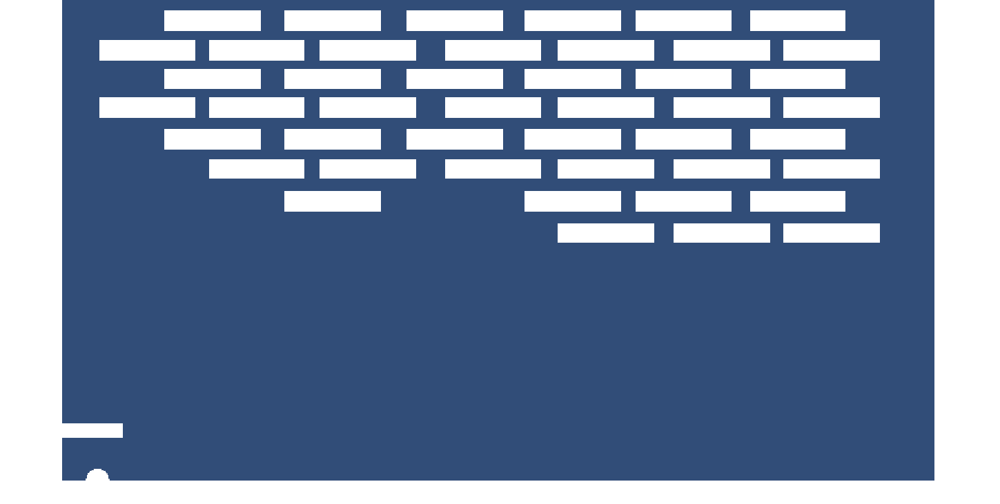
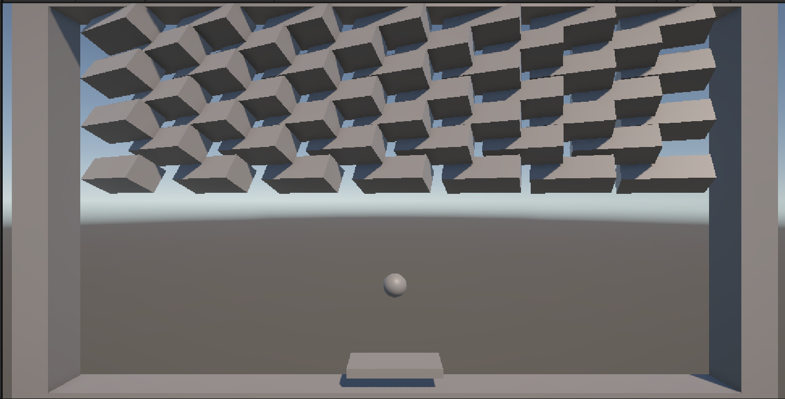
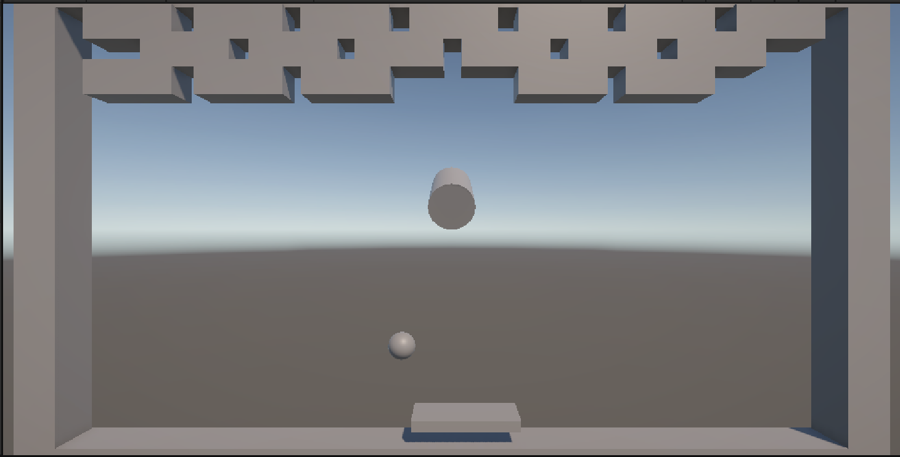
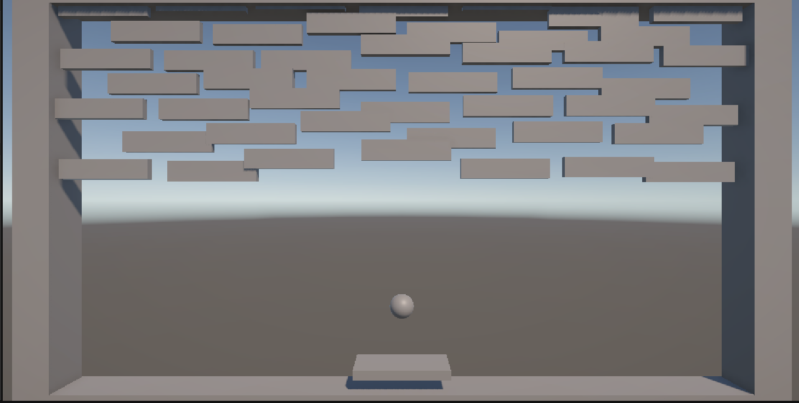
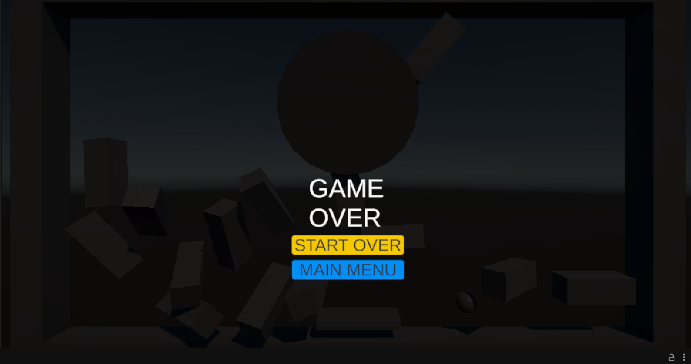

# Brick Breaker Reflection

For my first two prototypes I wanted to understand the basics of Unity. This included things like the interface, specific interactions (dragging and dropping), the code itself and just general unique features of Unity that I hadn’t encountered in other softwares. This was a big hurdle for me because I felt really out of my depth and so I didn’t have the confidence in myself to make something I was happy with. This led me to work on my two features which I’ll mention later, for multiple iterations of my game. It wasn’t until my final iteration that I finally felt confident and comfortable enough to start playing in the software. 

The first prototype was largely based off the one we did in class and I subsquently added my first feature to prototype 2a. With this prototype I wanted to experiment with adding a “dribbling” where the user would have to trap the ball between the paddle and the floor in order to gain speed on the ball. This feature was supposed to change the simulated space of the game to be a fast and chaotic environment encouraging the user to have quick reaction times to the ball. From this prototype I learned how mistakes can become features because the idea came from a bug in my original game where the ball would lose momentum and “dribbling” it would speed it up. This interaction became so fun to my playtesters that I knew I wanted to implement it with code, so that’s what I did. When I played people the new version, the code wasn’t working that well so often the ball would get too fast or not ever get fast enough to bounce up to the paddle in the first place. I really enjoyed this feature, but ultimately, I decided to let it go, as it was causing problems in future iterations. 

My second prototype was unfortunately a step back from the first. By this time I still felt like I hadn’t gotten the hang of Unity so I decided to rebuild the game from scratch, this time in 2D. Around this time I also started getting ideas of a horror themed breakout game which is why I chose 2D, hoping that it would make my subsequent prototypes more in line with my vision. Ultimately this wasted my time a bit, and I wish I’d stuck to my original breakout game as I developed my final version in 3D anyway. However, this prototype helped me in a lot of ways. I got way more comfortable with Unity, I and I started developing my own version of a physics system. Perhaps the biggest thing I learned was to not be so tied to an idea when developing my game or with any creative project where I’m not familiar with the software. Trying to create the replica of the idea I had in my head ultimately blocked me off from other ideas that were working and tied me to something I couldn’t actually do because I lacked the skill and familiarity. 

![Screenshot 2025-02-25 175837.png]
(breakout1.png)

For my B-type second prototype I switched back to my original 3D version and focused on adding another feature which I’ll call “shooting.” When the ball hits the paddle, the ball will shoot off in the direction of where the paddle is moving. This idea also arose from a bug where the ball kept getting stuck on the wall horizontally bouncing up and down. I thought it would be cool to be able to knock it somehow. Implementing this feature took me the longest and ultimately resulted in the breakdown of my first dribbling feature. I couldn’t get both of them to work together no matter how hard I tried. Ultimately I stuck with this feature in the end because I felt it was cooler than the dribbling one. 

By my third iteration I was finally comfortable with the software and with play. It was here that I finally implemented my own physics system. Using a combination of Rigidbody in Unity and my own forces such as air resistance and velocity, I was finally able to get some control on the vibes of the game wheras my other two prototypes had pretty simple physics. I also became more comfortable playing with the code that I’d implemented. All of the concepts had started to click as I developed this final iteration. It was here where I thought back to my original horror idea and felt confident in playing with the scene. I implemented a timer in the form of a sledgehammer, wonky moving bricks and different brick layouts to depict what I felt an uncomfortable change. 

I half used Unity’s physics system while implementing my own forces within the game. I originally had the idea to make a horror themed brickbreaker game so I wanted the game to have a slightly unsettling feeling to it. This is why the bricks are set up in weird ways, the ball moves but only slightly, the timer is in the form of a giant barrel hitting the bricks. I just wanted to implement some simple things in a fun way. The sense of discomfort, the layout, and the feel ultimately became to represent the discomfort and mistakes I made while creating the game in a way that I’m proud of. 

Ultimately, the game is pretty clunky and nothing like I originally envisioned, but I am proud of the work I did and everything I learned to get there. Ultimately I learned to let go of my ideas and trust that the right understanding of the project will come to me as I develop, this was a big challenge for me, as I get very attached to my ideas, even if I know it will take a miracle to pull them off. However, I’m learning now that I trust my vision no matter when it comes, and that’s all that’s necessary to creating something I’m proud of.
 
