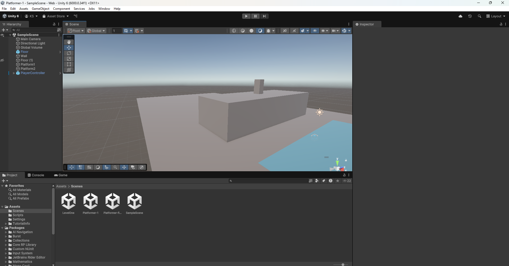
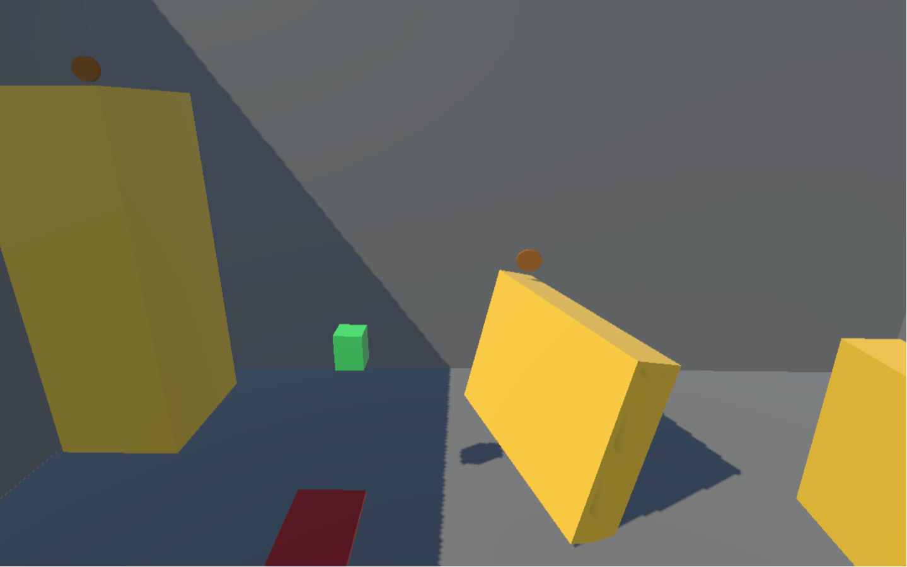

# Platformer Reflection

Prototype One:

- What were you experimenting with with your prototype?
    - For this prototype I was trying to mess around with diffrent surfaces and jump mechanics. I couldn’t, for the life of me though get this to work. I was slipping and sliding all over the floor, my jump was glitching, it just was not a fun time.
    - I was also exploring other web based platformers that I really enjoyed, particularly Fancy Pants which is a game I grew up playing. I really enjoy the physicality of that game, so how my fingers move when trying to get my characters perfectly positioned to make that jump or arrive on a certain platform.
- What did you learn?
    - I learned a lot about Unity’s rigidbody and character controller systems as those were the two things I messed around with. At one point I had both a rigidbody and a character controller on my character and that caused all sorts of weird things to happen. These are pretty novice things, but this is the first prototype I’ve ever made.

- [https://goobergirl15.github.io/game-dev-spring2025/builds/platformer-1/](https://goobergirl15.github.io/game-dev-spring2025/builds/platformer-final/)

Prototype Two

- What were you experimenting with with your prototype?
    - For this prototype I actually started building out a map and creating collectibles and gravity/ jump mechanics. One aspect of Fancy Pants that I love is the jumping and so I wanted to try experimenting with that. Eventually I ended up with this kind of floaty, hovery jump. It reminds me of kirby a little bit. Also I just added some simple coin collection to encourage the player to use the jump and explore the platforms.
- What did you learn?
    - I feel like I learned more about how to translate physical feelings in a simulated 3D space. It was hard for me to wrap my head around in the beginning, but by doing this platformer I feel like I have a better understanding of “game feel.” Having not had too much experience with Unity and not playing very many games I don’t think I had the prior knowledge to understand, let alone implement “game feel.” But this process of making the platformer allowed me to dive right in and learn through experience. It was so fun that I really want to explore creating in a 3D space more and understand how to simulate better and better mechanics. x

- [https://goobergirl15.github.io/game-dev-spring2025/builds/platformer-final/](https://goobergirl15.github.io/game-dev-spring2025/builds/platformer-final/)