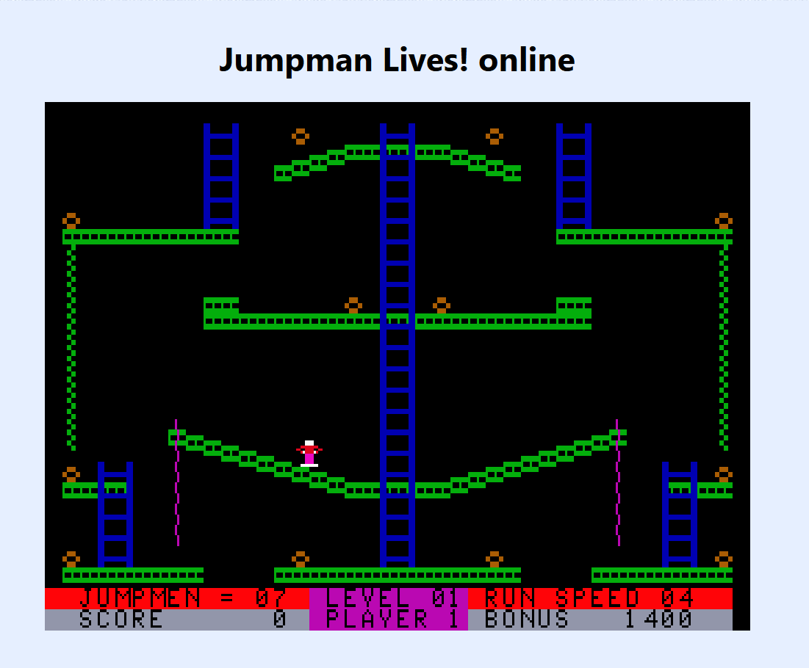
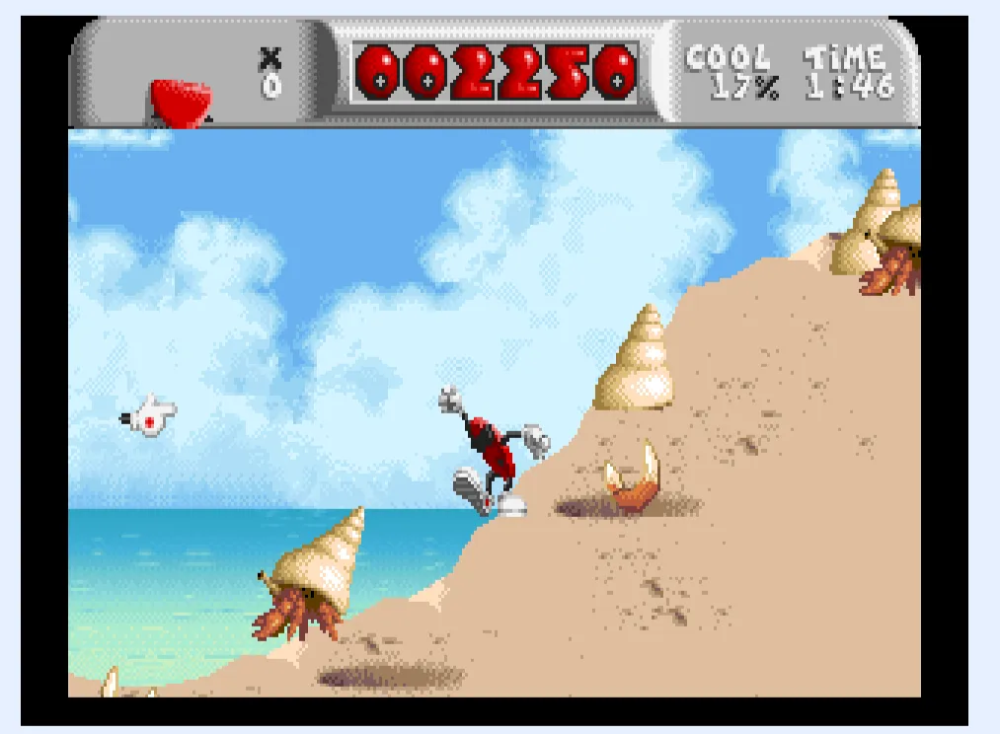
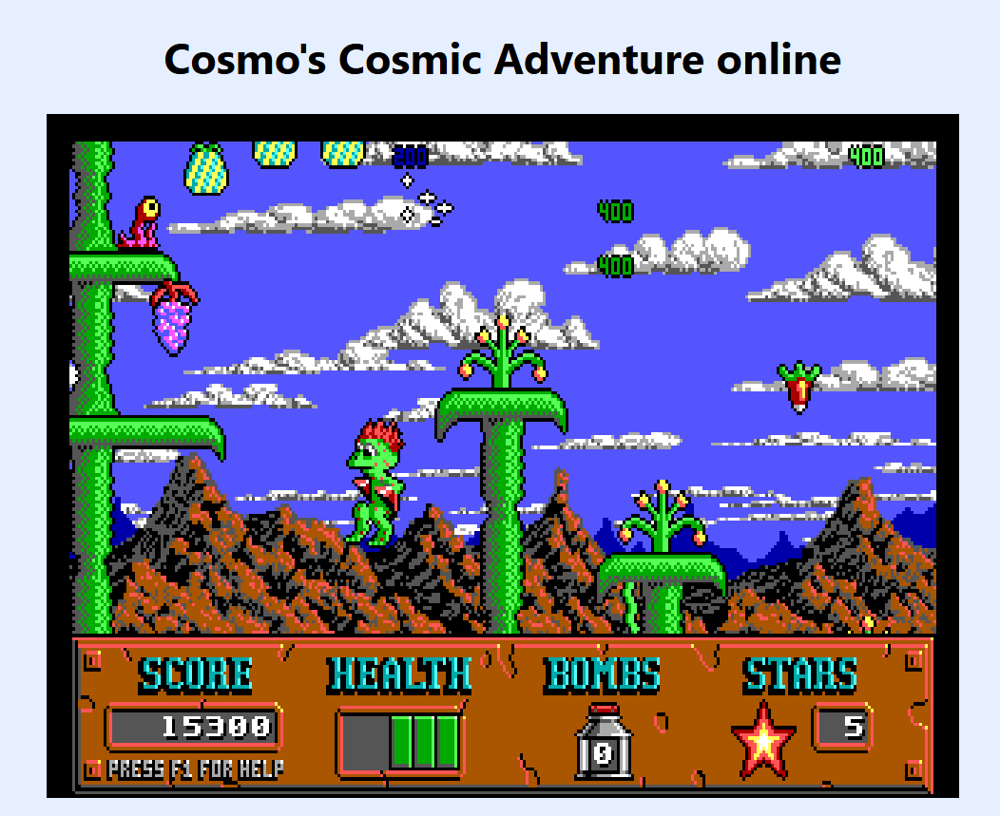

All games were found and played from: https://www.classicdosgames.com/genre/platform.html

### Jumpman Lives! (1991)

Explosives have been scattered throughout a laboratory on Saturn, and you play an elite anti-terrorist agent trying to prevent the destruction of the planet. You must climb ladders and jump around with special high jump boots, collecting all of the little orbs that represent bombs on each level, while avoiding enemies and trying not to fall too far. 

When the character is moving you move quite fast in order to dodge enemies and quickly tranisiton from jumps and climbing. You can jump while moving, there’s a hard cut off at the end of the moving jump, it just forces you straight down rather than moving an an arc like one might expect so precision on where you want to land is important. The platforms are relatively close together, but far enough to indicate what’s a traversable jump and what’s not. 

## Cool Spot (1994)

Despite being an advertisement for 7 Up, this platform game about Cool Spot's quest to collect 7 Up spots is really good, winning fans and even awards for its music. Cool Spot can shoot soda bubbles in eight directions, and can jump and grab onto things like balloons.

The character has a wide berth when he steps, cool guy movement. Almost like gliding instead of walking makes it feel very slick. There’s multiple jumps. Space + arrow is a small directional jump, long hold space + arrow is a directional dive and long hold space is a higer jump. These jumps are very similar to the way the character moves in that it feels like the character is gliding through the air. There’s a distinct arc to the charcter’s jumps. It’s a bit difficult to control the positioning of the jumps as it’s a scrolling platformer so you can’t necesarily see what’s in front of you. However, the enemies are very directional so they either try to get you from nelow or from the sides. This encourages more jumping movements. 

## **Cosmo's Cosmic Adventure (1992)**

Cosmo is a young alien who is heading to Disney World when their ship is forced to crash land on a strange planet. Cosmo's parents are abducted while he goes exploring, and now he must rescue them. Cosmo can stick to walls and jump on enemies. There are lots of hidden items and bonuses and secret areas to search for. There are 3 episodes in this game, with only the first episode playable in the shareware version.

It’s a little chunky and clunky, but easier to manuever with the jumps. Each arrow press only moves you forward a little bit so on one hand there’s more control but if you stop pressing the arrow the character stops abrubptly. There’s multiple types of jumps. Holding the arrow keys and the space bar also changes the way the character can jump. The character can do a long jump when holding down the space and the up arrow key there’s a lot of control in the air, the character can change directions in the air depending on which key is pressed and that transition happens pretty quickly.

There are these long vine platforms that you can jump on in order to get the eggs and gain points. The enemies are also distributed throughout the game on the platforms and on the ground. They can’t jump but the do fall on you so there’s a dodging mechanism at play. To encourage jumping the game places much of the eggs at the top of the map instead of in front of you. 

